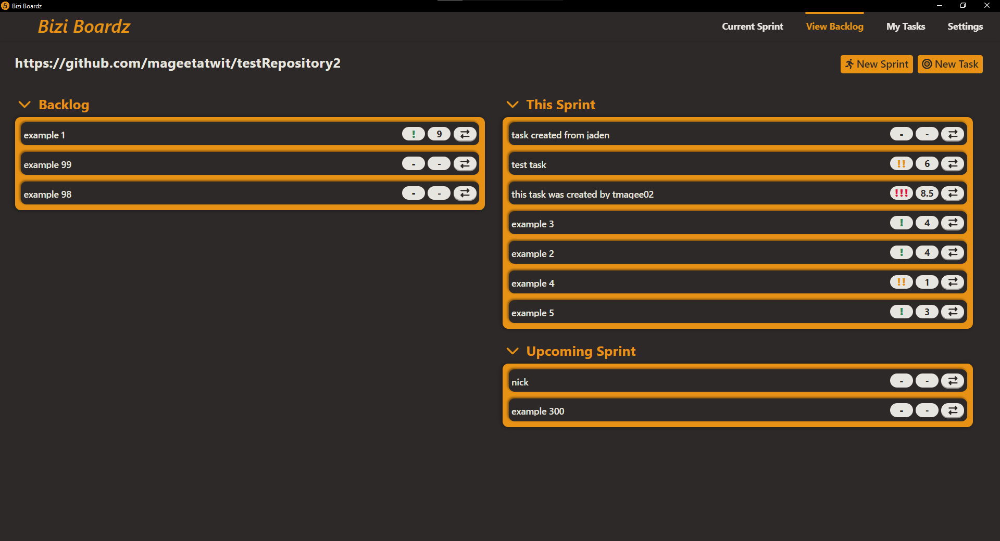
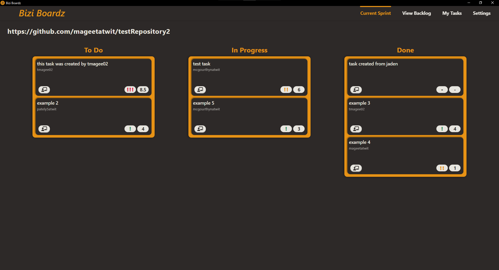
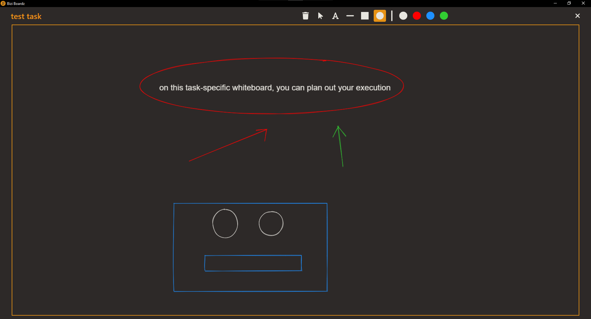
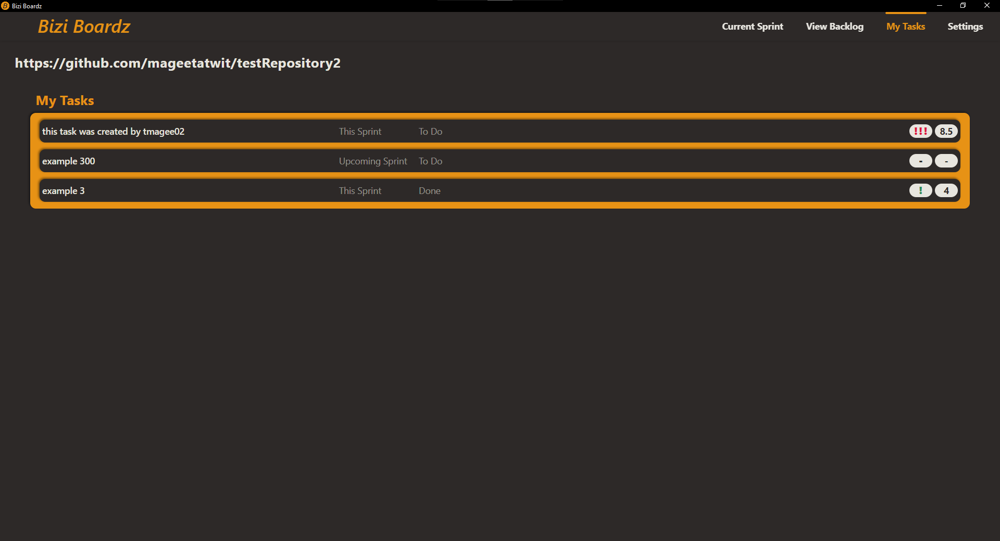
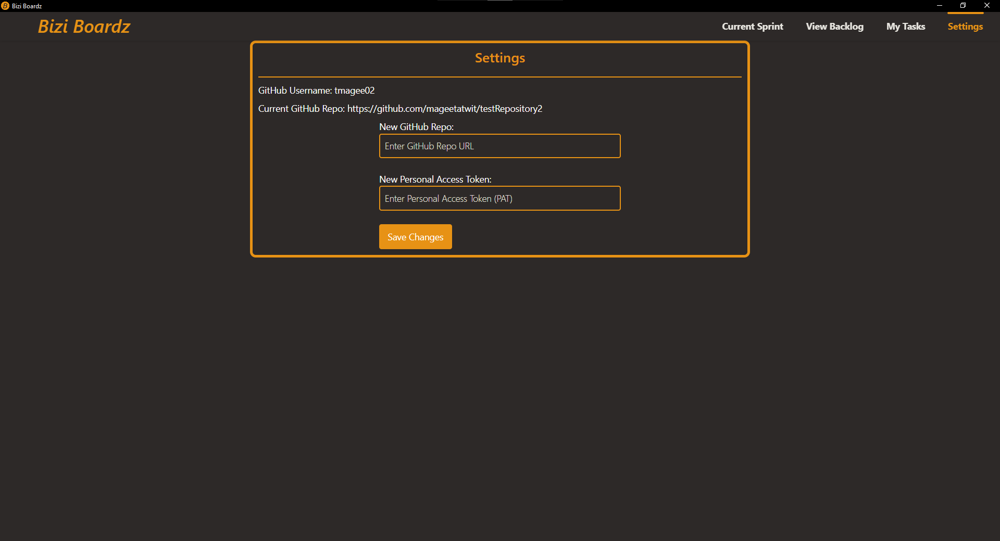

# bizi-boardz
A copy of the bizi-boardz repo. Originally created by ***The Bizi Boyz***

### The Bizi Boyz
- Tim Magee 
- Nick Mcgourthy
- Jaden Reid
- Yogi Patel

Bizi Boardz is a desktop application with project management features leveraging GitHub for data storage, taking inspiration from other applications such as Jira, Asana, and Miro. 

There are 4 different pages available to the user: 
1. View Backlog (the landing page)
2. Current Sprint
3. My Tasks
4. Settings

## View Backlog
View Backlog is the first page that the user sees when they boot up the application. Here the user can view all tasks that are currently availible to the team that they are collaborating with.

In the top-left of this page, you can see the current GitHub repository you are currently connected to. There are 3 sections on this page that each have a set of tasks available to the team:
1. Backlog - tasks that are created but not yet assigned to a sprint
2. This Sprint - the set of tasks the team is working on in the current time period (generally 2 weeks)
3. Upcoming Sprint - The set of tasks that will be worked on in the near future

In order to transfer a task to a different section, just press the double arrow button on the right side of the task line. On each task line you can also see the priority of a task (denoted by exclamation marks) and the estimated time to complete the task.

If you want to start the new sprint, all you have to do is press the New Sprint button. This will archive any tasks in the 'This Sprint' section and replace them with the tasks in the 'Upcoming Sprint' section.

If you want to add a new task to the backlog, click on the 'New Task' button in the top-right corner of the screen. This will load the Create New Task popup.

In this popup, you can give the new task a name, assign it to any other contributor in the GitHub repo that you are connected to, state the task's current progress, priority, task length, and give it a description.

## Current Sprint
The Current Sprint page shares a lot of the same details about a project as the View Backlog page, but here the user can focus purely on items that are in the project's current sprint.

Similar to the View Backlog page, you are able to see the current repo you are working in in the top-left corner. You can also see columns labeled 'To Do', 'In Progress', and 'Done' that signify the current state of a task. You can edit any info about a task (reassigning it, editing the description, etc.) by simply clicking on the task card. 

If you want to sketch out details on how you want to go about completing a certain task, you can click on the button in the bottom left of any task card. This will load a task-specific whiteboard popup.

On the top part of the whiteboard popup, you can see the title of the task that you selected as well as the whiteboard tools (text, shapes, colors, select, delete). This environment updates in real time, so it is a great place to collaborate and problem solve with other contributors in the repo.

## My Tasks
On the My Tasks page, the user is able to focus on tasks that are currently assigned to their GitHub username.

This page is pretty simple. You can see many of the same things as the Current Sprint and View Backlog pages such as task names, priorities, and task lengths. Also similar, you can edit tasks by clicking on the task line you want to change. The main role of this page is to view only the tasks assigned to you, where they are in the backlog, and their current progression.

## Settings
On the Settings page, you can see the current GitHub account you are logged into as well as the repo you are connected to. If you want to change projects or enter a fresh Personal Access Token (PAT), just enter the info in the textboxes and press save changes.

## Launching Bizi Boardz
*==Note: As of now, Bizi Boardz is not usable to people outside of the Bizi Boyz, due to .env variables that will not be shared with the public due to security concerns==*

Requirements:
- A GitHub account
- Node.js

Steps:
1. Generate a GitHub PAT token with repo authentication
2. Open a terminal and move to the bizi-boardz directory ($cd bizi-boardz')
3. Install all dependencies ($npm install)
4. Run the application ($npm run electron:serve)
5. Once the application loads, enter the desired GitHub repo URL as well as your personal access token (PAT)
6. Enjoy :)