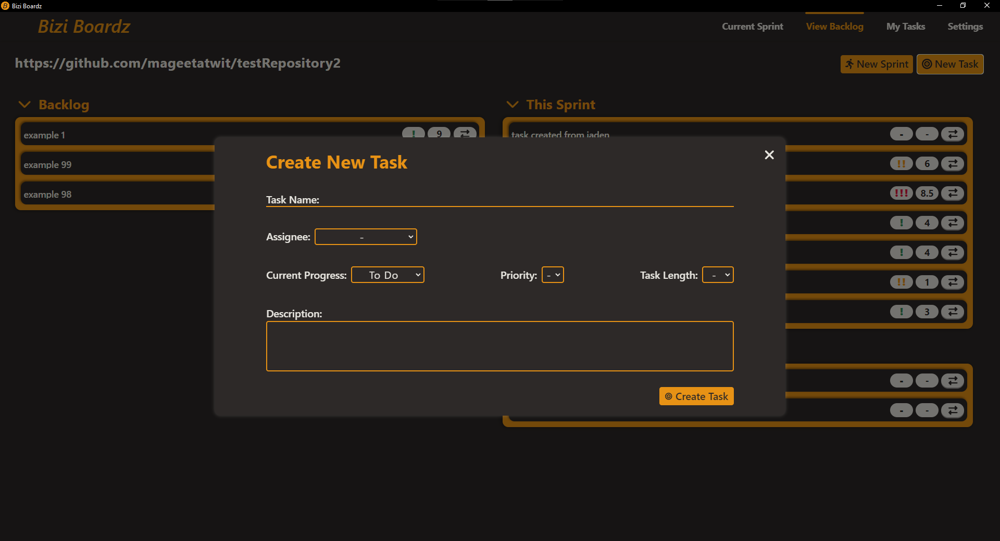

# bizi-boardz
A copy of the bizi-boardz repo. Originally created by ***The Bizi Boyz***

### The Bizi Boyz
- Tim Magee 
- Nick Mcgourthy
- Jaden Reid
- Yogi Patel

Bizi Boardz is a desktop application with project management features leveraging GitHub for data storage, taking inspiration from other applications such as Jira, Asana, and Miro. 

There are 4 different pages available to the user: 
1. View Backlog (the landing page)
2. Current Sprint
3. My Tasks
4. Settings

---
## View Backlog
View Backlog is the first page that the user sees when they boot up the application. Here the user can view all tasks that are currently availible to the team that they are collaborating with.

In the top-left of this page, you can see the current GitHub repository you are currently connected to. There are 3 sections on this page that each have a set of tasks available to the team:
1. Backlog - tasks that are created but not yet assigned to a sprint
2. This Sprint - the set of tasks the team is working on in the current time period (generally 2 weeks)
3. Upcoming Sprint - The set of tasks that will be worked on in the near future

In order to transfer a task to a different section, just press the double arrow button on the right side of the task line. On each task line you can also see the priority of a task (denoted by exclamation marks) and the estimated time to complete the task.

If you want to start the new sprint, all you have to do is press the New Sprint button. This will archive any tasks in the 'This Sprint' section and replace them with the tasks in the 'Upcoming Sprint' section.

If you want to add a new task to the backlog, click on the 'New Task' button in the top-right corner of the screen. This will load the Create New Task popup.

In this popup, you can give the new task a name, assign it to any other contributor in the GitHub repo that you are connected to, state the task's current progress, priority, task length, and give it a description.

---
## Current Sprint